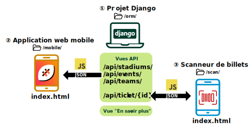
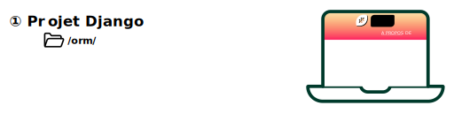

# Atelier de professionnalisation n°2 - Rugby Tropical Cup


* 🕓 Durée : 2~3 mois
* 🤝 Réalisation : En individuel

## 🧰 Compétences mobilisées

* Utilisation d'un gestionnaire de versions pour son code
* Usage de l'HTML et du CSS pour créer des pages statiques
* Déployer un service
* Vérifier les conditions de la continuité d’un service informatique

## 🏁 Objectifs

Mettre en oeuvre les enseignements côté Django et Web design à travers un projet en rapport avec ce qui a déjà été vu en cours.

## 💻 Outils

* Un gestionnaire de versions : GitHub, GitLab...
* Un tableau de tâches Kanban : GitHub Projects, GitLab Issues Boards, [Trello](https://trello.com/fr)...

---



## ① Projet Django



En partant du projet [**Django ORM**](https://github.com/esieeit-slam-2023/django-course/tree/main/projects/orm), vous devrez le dupliquer afin d'y ajouter plusieurs choses :

* Une nouvelle **vue** liée à une nouvelle **template**, représentant une nouvelle page nommée "En savoir plus"
* Un fichier contenant plusieurs **vues** sous forme de fonctions, afin de créer une API très simple

### Page "En savoir plus"

Le but de cette page est de présenter le sport du [Rugby à XV](https://fr.wikipedia.org/wiki/Rugby_%C3%A0_XV) ainsi que le [Japon](https://fr.wikipedia.org/wiki/Japon) où se déroule la compétition. Pour cela, utilisez des sources librement utilisables (Wikipédia...) tout en prenant soin de les [citer](https://fr.wikipedia.org/wiki/Wikip%C3%A9dia:Citation_et_r%C3%A9utilisation_du_contenu_de_Wikip%C3%A9dia) correctement. Des photos libres de droit peuvent se trouver sur des sites stock ([Pexels](https://www.pexels.com/fr-fr/), [Unsplash](https://unsplash.com/)...) ou sur des sites communautaires comme [Wikimedia Commons](https://commons.wikimedia.org/wiki/Accueil) ou encore [Flickr](https://www.flickr.com/) (en choisissant les photos "**Tous les Creative Commons**" ou "**Aucune restriction des droits d'auteur connue**").

N'oubliez pas d'ajouter cette page au menu principal du site web afin d'y accéder facilement.

### Vues "API"

Contrairement aux vues destinées à l'affichage de templates qui sont généralement basées sur des classes Python, nous pouvons revenir aux formes plus "primitives" des vues qui consistent en une simple fonction acceptant une [HttpRequest](https://docs.djangoproject.com/fr/3.2/ref/request-response/#httprequest-objects) et renvoyant une [JsonResponse](https://docs.djangoproject.com/fr/3.2/ref/request-response/#jsonresponse-objects).

Le but est de proposer plusieurs URLs (endpoints) qui, lorsque appelées par des requêtes **GET**, renvoient ce qu'il se trouve dans la base de données, dans un format **JSON**  prêt à l'emploi. Voici les différentes URL à créer :

* /api/stadiums/
* /api/events/
* /api/teams/

Vous êtes libres de déterminer comment renvoyer les données au format JSON, car c'est vous qui coderez ensuite l'application mobile qui va se servir de ces données. Par exemple, la liste des stades renvoyée par l'URL `/api/stadiums/` peut ressembler à ceci :

```json
{
    "stadiums" : [
        {"name": "Ajinomoto Stadium", "location": "Tokyo", "latitude": 35.664051, "longitude": 139.527175},
        ...etc...
    ]
}
```

On créera également l'URL suivante qui, lorsque l'on lui passe un ID d'un billet, nous renverra ses informations s'il existe, ou nous renverra une erreur s'il n'existe pas.

* /api/ticket/{id}/

Pour appeler cette URL, il faudra absolument lui passer l'ID du ticket

Pour simplifier le tout, on peut écrire toutes ces nouvelles vues dans un unique fichier nommé `api.py`. Attention, bien qu'étant dans un même fichier, chaque **fonction** sera bien une **vue** à part entière du point de vue de Django. Il faudra correctement les importer et les relier à des URLs dans le fichier `urls.py`.

Liens pouvant vous aider :
* https://books.agiliq.com/projects/django-api-polls-tutorial/en/latest/apis-without-drf.html
* https://dev.to/alexmercedcoder/creating-a-restful-api-with-django-without-djangorestframework-17n7

### Gestion des CORS

Afin que vos URLs soient accessibles plus tard par l'application web mobile et le scanneur de billets, il vous faudra au préalable installer un middleware permettant de gérer les [en-têtes CORS](https://fr.wikipedia.org/wiki/Cross-origin_resource_sharing). Ils permettent d'autoriser les requêtes venant de votre page web, accédée depuis un autre appareil (téléphone...) jusqu'à votre projet Django qui est exécuté sur votre ordinateur.

1. Installer le middleware en exécutant `pip install django-cors-headers` (ou `pip3` selon votre système d'exploitation)
2. Ajouter la ligne suivante au sein de la variable `INSTALLED_APPS` du fichier de paramètres `base.py` en faisant en sorte que ce soit la **première ligne** du tableau

```python
    INSTALLED_APPS = [
        'corsheaders',
        ...
    ]
```

3. Ajouter la ligne suivante au sein de la variable `MIDDLEWARE` du fichier de paramètres `base.py` en faisant en sorte que ce soit la **première ligne** du tableau

```python
MIDDLEWARE = [
    'corsheaders.middleware.CorsMiddleware',
    ...,
]
```

4. Ajouter la variable suivante dans le fichier de paramètres `base.py`

```python
CORS_ALLOW_ALL_ORIGINS = True
```

---

## ② Application web mobile

Pour accompagner les évolutions opérées sur le côté back-end, il faudra créer une page web complètement indépendante et utilisant les **URLs API**, afin de récupérer les données concernant la Rugby Tropical Cup.

L'usage de Javascript permettra d'afficher plusieurs pages tout en restant sur une unique page web, destinée à être visionnée uniquement sur des appareils mobiles. Il faudra alors faire attention aux performances et à l'adaptation à un écran étroit.

Lorsque l'utilisateur clique sur le nom d'une page dans le menu, il faudra donc afficher cette dernière, en charger les données reçues au format JSON, puis les afficher au sein de la page (c'est à dire construire le HTML depuis Javascript, d'une façon ou d'une autre).

Pour cela, vous pouvez rester en Javascript pur ou bien utiliser une bibliothèque front-end comme [Vue.js](https://vuejs.org/), [React](https://fr.reactjs.org/).

Vous êtes entièrement libre de l'implémentation et de l'affichage des données, mais il est toujours préférable de respecter la [charte graphique](https://github.com/esieeit-slam-2023/python-course/tree/master/exercices/rugby#%C3%A9criture-sur-le-billet) de la Rugby Tropical Cup (couleurs, polices...)

---

## ③ Scanneur de billets

En plus de la petite application mobile, une autre page web indépendante aura pour unique but de scanner le QR Code inscrit sur les billets de la compétition. Après avoir scanné le QR Code contenant l'identifiant du billet, il faudra appeler **l'URL API** permettant de savoir si un billet est valide ou non, et en afficher les informations afin de comparer avec ce qui est imprimé sur le billet.

Pour la détection d'un QR Code à l'aide de la caméra d'un téléphone, on utilisera la bibliothèque Javascript [QR Scanner](https://github.com/nimiq/qr-scanner). Cette dernière nous renverra le contenu encodé dans le QR Code au moment où il réussira à être scanné.

Vous êtes libres d'utiliser une bibliothèque front-end comme [Vue.js](https://vuejs.org/), [React](https://fr.reactjs.org/), etc. Préférez cependant l'usage du Javascript "pur" tel qu'enseigné dans le cours [javascript-front](https://github.com/esieeit-slam-2023/web-design/tree/master/javascript-front) plutôt qu'utiliser une bibliothèque désuète comme jQuery.

### Débogage

Cet exercice utilisant l'accès à la caméra depuis Javascript, nous allons nous heurter à quelques problèmes suite à la sécurité imposée par les navigateurs web.

Lorsque vous voudriez tester cette page web sur votre ordinateur, vous pourrez ouvrir directement le fichier dans le navigateur web ou encore créer à la volée un petit serveur web qui servira la page sur l'adresse `localhost` (par exemple à l'aide de Python ou de l'extension [Live Server](https://marketplace.visualstudio.com/items?itemName=ritwickdey.LiveServer) pour VS Code).

Pour tester votre page sur votre téléphone, il faudra soit la télécharger et l'ouvrir à la main, soit l'ouvrir depuis un site web servi strictement en **HTTPS** afin d'avoir l'accès à la caméra de fonctionnel. Aussi, vous ne pourrez pas accéder au serveur web de test qui tourne sur votre ordinateur depuis votre téléphone (en tapant l'IP locale de l'ordinateur) car dans ce cas le navigateur refusera d'afficher la caméra sur un serveur web n'utilisant pas **HTTPS**.
